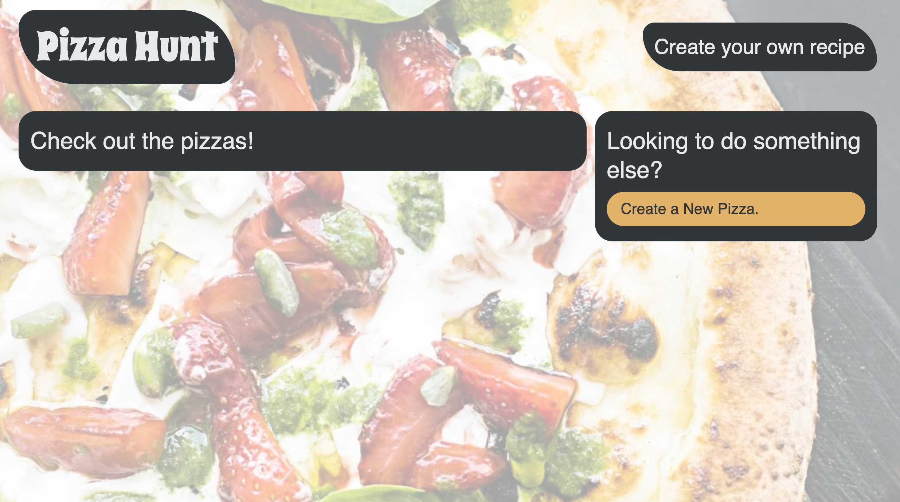

# Pizza Hunt

## Description
A social media recipe app where users can post their creative spins on pizza, add comments to recipes, and create threads within comments.

## Table of Contents
[Deployed Application](#deployed-application)  
[Landing Page](#landing-page)  
[Built With](#built-with)  
[Installation Instructions](#installation-instructions)  
[Contribution](#contribution)  

## Deployed Application
https://pizza-hunt-dch.herokuapp.com/
## Landing Page

## Built With
* JavaScript
* Node.js
* Express.js
* MongoDB
* Mongoose ODM
* MongoDB Atlas

## Installation Instructions
npm, Node.js, Express.js, MongoDB and Mongoose ODM must be installed to run this application locally.

* To initialize npm, enter "npm init" in terminal while in the root folder of the project
* Node.js can be downloaded and installed from https://nodejs.org/en/download/  
* MongoDB can be downloaded and installed from https://www.mongodb.com/docs/manual/administration/install-community/
* To install Express.js enter "npm install express" in terminal while in the root folder of the project
* To install the Mongoose package, enter "npm install mongoose" in terminal while in the root folder of the project

Once the above steps have been followed, enter "npm start" in terminal to run the application

## Walkthrough Video
https://drive.google.com/file/d/1BKILEPMF_TmyDFQIWBrxAEqyURYllsTL/view

## Contribution
Made with ❤️ by Dylan Hay